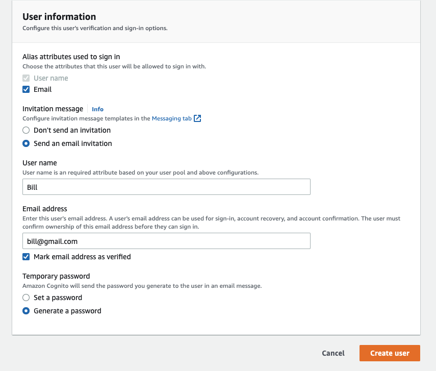
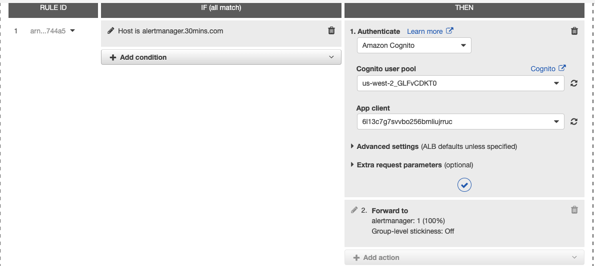
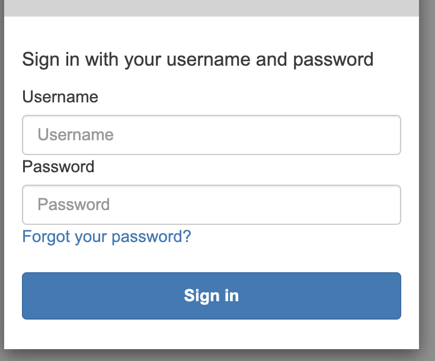

# Authenticate users using an Application Load Balancer with Cognito user pool

There are a lot of tutorial on how to setup authenticate users with Cognito user pool using AWS ALB, the setup is not strathforward. 

With this terraform codes, you can setup the cognito for the ALB to use directly. It has been adjusted for ALB purpose already.

After that, you can understand how cognito integrates with ALB, and do some adjustments easily.

### Steps

1. Deploy Cognito with terraform

```
# make sure you have set AWS CLI config to the proper aws account
# use this command to confirm
aws s3 ls

# dry-run
terraform init
terraform plan -var-file=staging.tfvars

# if everything looks fine, uncomment below line
# terraform apply -var-file=staging.tfvars
```

It will deploy the cognito user pool in your account in default region you set

2. create users in cognito

Create users in cognito is easy, jump to the new created cognito user pool, go to users and create one



3. integrate cognito into ALB

edit rules in ALB, add new authenticate using Cognito, choice the cognito id and app client id



4. test

now if you access your website, it will ask for username and password



### cost of cognito

cognito user pool is less cost, nearly free

https://aws.amazon.com/cognito/pricing/
 
### Reference

https://docs.aws.amazon.com/elasticloadbalancing/latest/application/listener-authenticate-users.html

